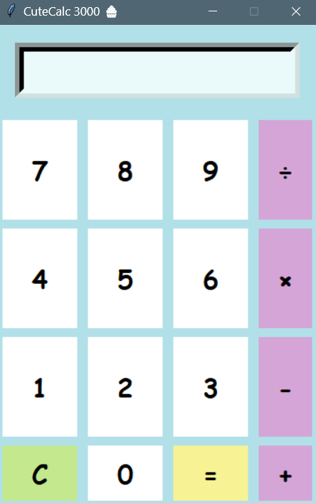

# Cute GUI Calculator

A cute calculator made in Python using Tkinter, inspired by kawaii pastel design.

## Features
- Supports +, -, ×, ÷, %, **, and brackets
- Soft pastel UI (like cute mobile calculators)
- Handles large numbers

## Run it locally
```bash
python PythonAppCalculator.py

**## Preview**

